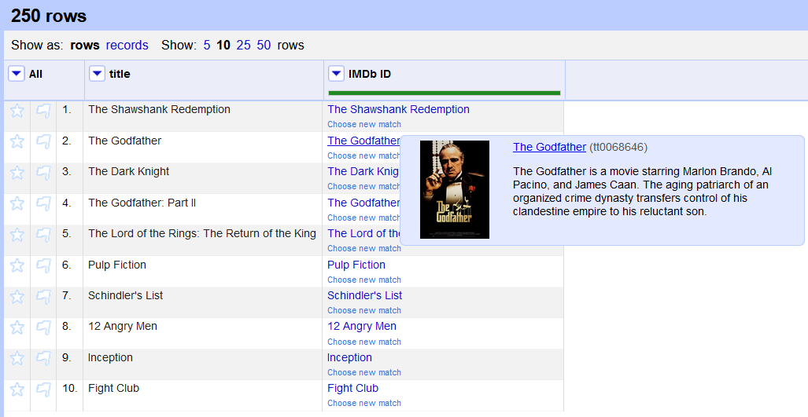
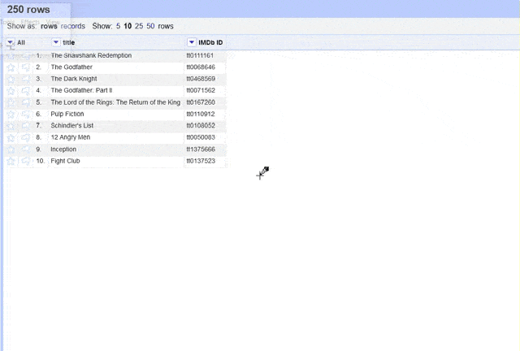
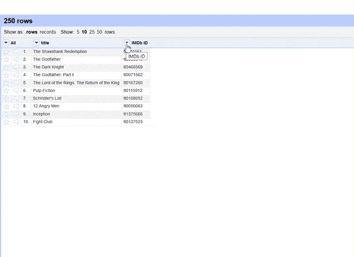
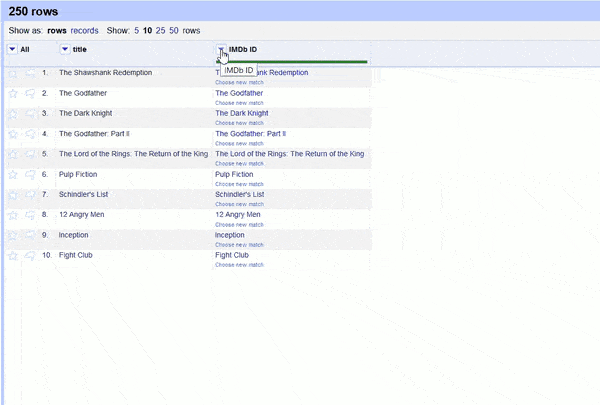

# IMDb reconciliation service
With this service you can match IMDb-IDs to their corresponding entries, load connected movie, TV and actor data from IMDb and compare it with Wikidata.

.NET Core implementation of an OpenRefine reconciliation service that takes IMDb-IDs and reconciles them to their IMDb entry. The Reconciliation Service API provides the Service Metadata, returns the title or name and the url, so that reconciled IMDb-IDs are clickable links. Further it is possible to extend the data by using the JSON-LD data of IMDb with the Data Extension API. The Preview API, Property Proposal API and Suggest API are also implemented.

Requirements
------------
Requires [OpenRefine](https://github.com/OpenRefine/OpenRefine)

How to use
----------
After starting OpenRefine, the service has to be started by running the executable (see [Releases](/releases)).

If you want to run the service from source code, [.NET Core 3.1 SDK](https://www.microsoft.com/net/download/all) is required and the service can be run with `dotnet run`.

To use in OpenRefine:
* Select a column containing IMDb-IDs > Reconcile > Start Reconciling…
* Add the following reconciliation service URL: http://localhost:5000/imdbreconcile/api
* Click "Start Reconciling"

To extend data:
* Select a column containing IMDb-IDs > Edit Columns > Add columns from reconciled values…
* Choose one or multiple of "Suggested Properties"
* Click on "OK"

-----------
For more info, see https://github.com/OpenRefine/OpenRefine/wiki/Reconciliation-Service-API.
